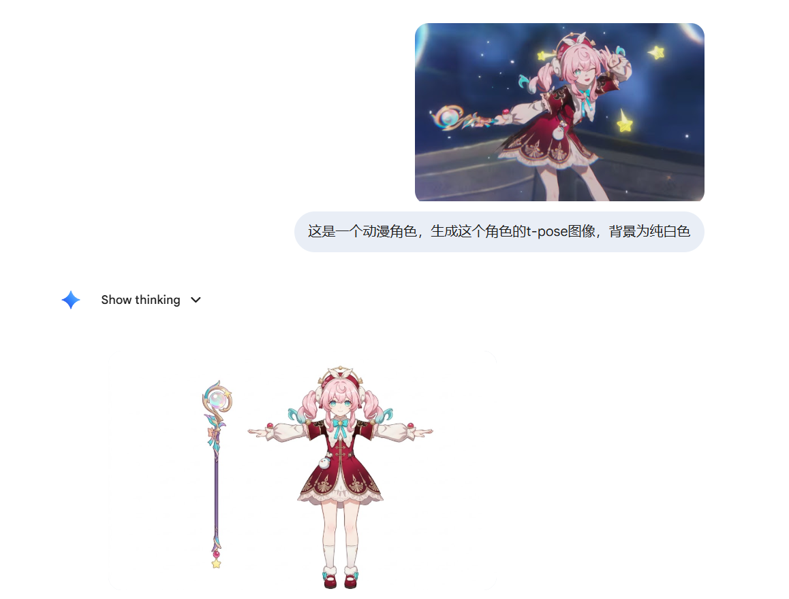
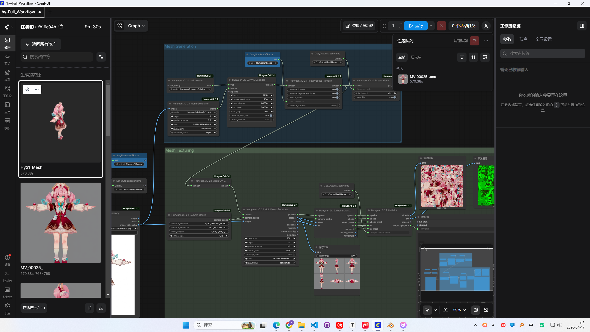
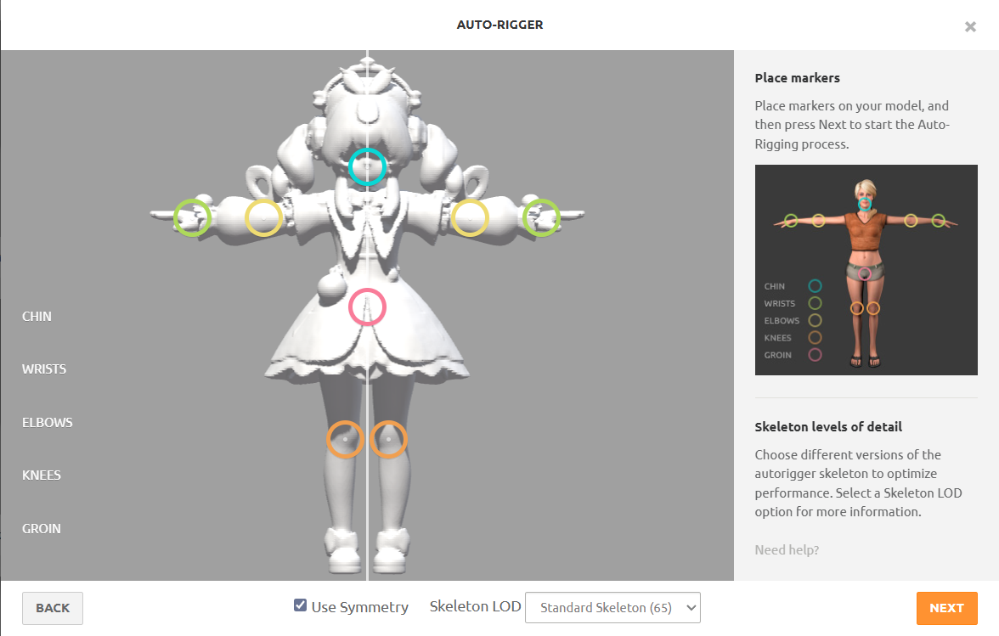
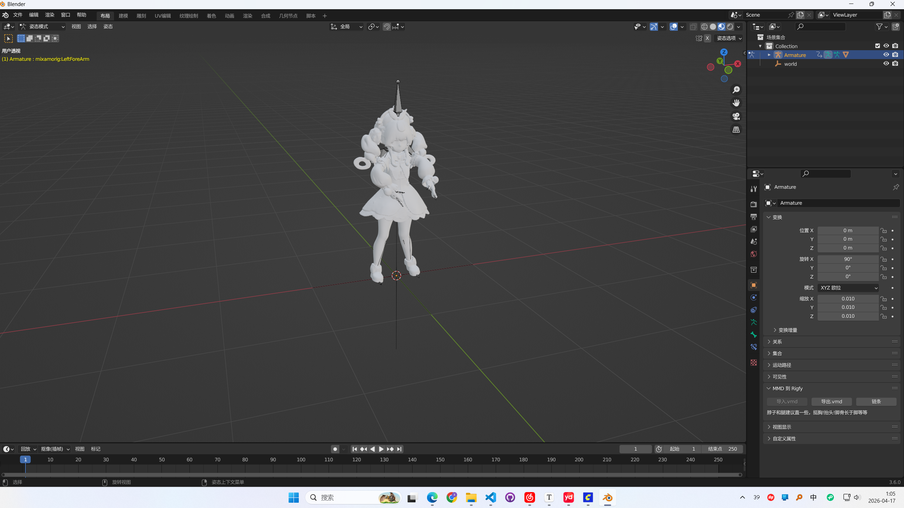

# AI Game Pipeline

> 现在世界模型的概念还是挺火的，也刷到过直接用神经网络模拟一个游戏。但是，这种方法，能保证场景的一致性吗？你也不想做了地形破坏后，转头又恢复了吧。所以目前的发展，应该还是基于游戏引擎，辅以AI做资源生成或者画质增强。
>
> 调研使用AI做游戏的一些技术栈

## 人物模型

> 从图片到模型再到动作的尝试
>
> 1. 使用nano banana生成人物不带背景的t-pose图片
>
> 2. 在comfyui中，使用hunyuan3d-2.1生成t-pose图像对应的模型
> 3. 在mixamo中，绑定骨骼，Adobe，yes！

1.使用nano banana生成一个角色的不带背景的t-pose图像

gemini老师还是太权威了~ 从风堇的pv里随便截取一张图，然后进行生成。

---

2.生成带纹理贴图的模型

---

3.导出到blender做格式切换

---

4.mixamo绑骨

还是太抽象了，纹理也没了，呜呜呜

## 动作序列

> 英伟达的kimodo模型很强啊，很强啊，但是是对一个人物模型通过“文本->动作”去生成的。如果说要做一个互动丰富的旮旯给木，可能会涉及到场景中多模型之间的互动，这个需要持续调研。

## 文案生成与策划

## 配音模型

> 1.使用cosyvoice做声音克隆和增强
>
> 2.训练一个matcha-tts做为轻量化的tts模型，好处是该模型有开源c++的推理框架。
>
> ---
>
> 现在好像新出了个LuxTTS，说是显存占用极低？？！！[ysharma3501/LuxTTS: A high-quality rapid TTS voice cloning model that reaches speeds of 150x realtime.](https://github.com/ysharma3501/LuxTTS)

## 游戏程序

